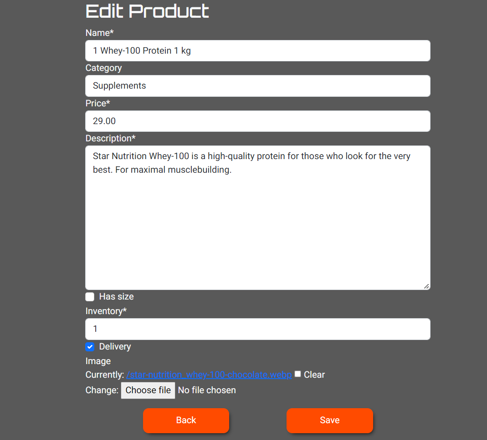
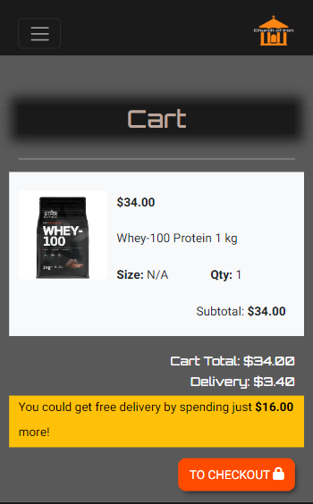
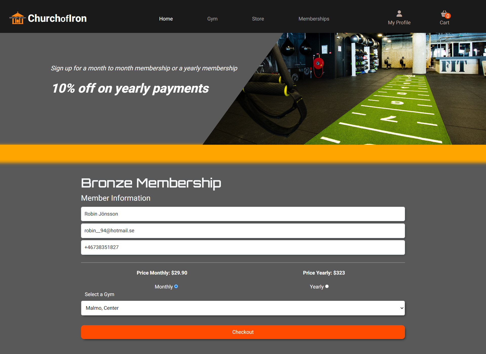
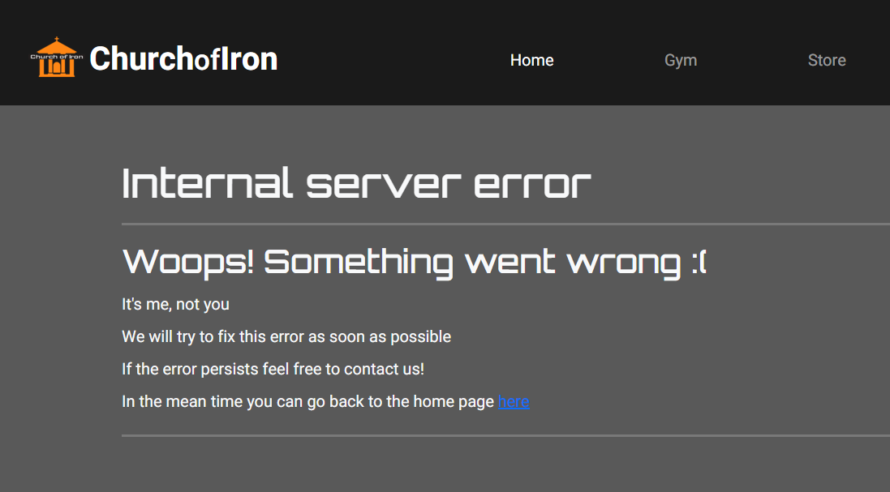
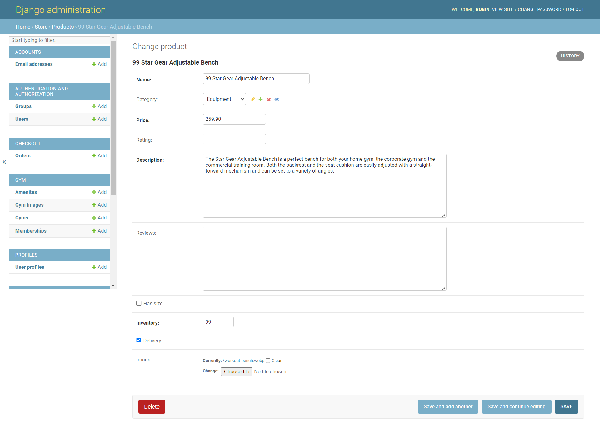
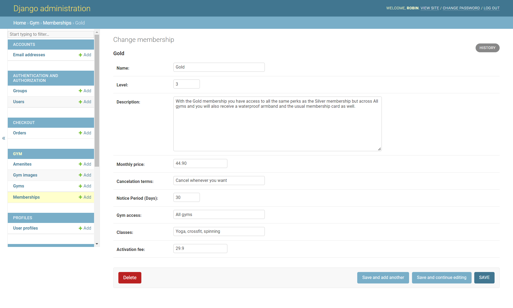

# Church of Iron

Church of Iron is a full stack web application. The application is a gym with memberships and an e-commerce online shop where that sells gym and fitness related products. It provides a smooth online shopping experience to the end users / customers.

The user is able to register an account, log in / log out to the account, update account profile, add products to the shopping cart and remove it from the cart, update product item quantity in the cart, delete the item from the cart.

The site processes online orders, provides an online secured payment method with Stripe. The signed in user is able to checkout and pay for the order. Church of Iron sends the order confirmation email directly to the user's email address. The store owner is able to edit or delete the product both on the frontend and on the backend.

The site is accessible across the devices tested using different browsers. The site sends out marketing newsletters directly to customers via MailChimp and has a Facebook page to promote the products.

The following card number can be used to checkout an order:

4242 4242 4242 4242 - 04/24 242 42424

Deployed live site: [Church of Iron](https://robin-church-of-iron.herokuapp.com/)

# Table of Content

- [Church of Iron](#church-of-iron)
- [Table of Content](#table-of-content)
- [UX](#ux)
    - [Color Scheme](#color-scheme)
  - [Agile Project Management](#agile-project-management)
    - [Database ERD](#database-erd)
      - [Models](#models)
    - [Business Model](#business-model)
- [Exisiting Features](#exisiting-features)
  - [Home Page](#home-page)
  - [Store Page](#store-page)
  - [Product Details Page](#product-details-page)
  - [Product edit page](#product-edit-page)
  - [Cart Page](#cart-page)
  - [Checkout Page](#checkout-page)
  - [The Profile page](#the-profile-page)
  - [Membership](#membership)
  - [Gym Pages](#gym-pages)
  - [Policy page](#policy-page)
  - [404 page](#404-page)
  - [Server error 500 page](#server-error-500-page)
  - [Django admin panel](#django-admin-panel)
  - [Future developments](#future-developments)
- [Technologies Used](#technologies-used)
  - [Languages & Frameworks](#languages--frameworks)
  - [Others Programs](#others-programs)
- [Testing](#testing)
- [Deployment](#deployment)
  - [Heroku App](#heroku-app)
  - [Amazon Web Services S3](#amazon-web-services-s3)
  - [Clone Project](#clone-project)
  - [Fork Project](#fork-project)
- [Credit](#credit)
  - [Content](#content)
  - [Media](#media)
- [Acknowledgement](#acknowledgement)

# UX

### Color Scheme

I used Mycolor.space as inspiration for the site's colors.

[Back to top](#church-of-iron)

## Agile Project Management

I used GitHub Agile project management tool to create user stories using issues and planned the user stories into three different stages using Kanban board with three columns that are `To do`, `In progress` and `Done`. The user stories are labeled with **MoSCoW** techniques to prioritize the project’s tasks.

### Database ERD

I used `Lucidchart` to create the project's database schema models which helps me to unserstand the relationship between the models. Heroku Postgres database and the SQLite are used for the project.

#### Models

-   **Django user** - Is the Django built-inThe user model.
-   **UserProfile** - Is used for user information and membership status.
-   **Product** - Is used for the product information.
-   **Catagory** - Is used for the category of the products.
-   **Gym** - Is used for storing information about the a gym.
-   **OrderItem** - Is used for combining the product with the order.
-   **Order** - Is used for the order placed by the user when processing online purchase.
-   **Membership** - Is used for storing information about memberships.
-   **Amenity** - Is used for combining amenities with gyms.
-   **GymImage** - Is used for linking images to gyms.

### Business Model

The Church of Iron application is a B2C business model that it does the business directly with the end customer. Add items to the cart or signing up for a membership, complete the order, make a payment through secured payment system.

-   #### Marketing

    Church of Iron has a Facebook page for reaching all the customers instantly. The shop owner is able to post any updates or promotions to gather sales. The Facebook page provides a great effective way of communicating with shoppers.

    I created the `Church of Iron Facebook page`. However as it's not a real business page, I made a screenshot of the Facebook page and deleted it afterwards in order to avoid any problems under Facebook's rules. The Facebook link in the footer opens the link to Facebook but not the actual `Church of Iron Facebook page`. Here is the one but deleted page.

    

[Back to top](#church-of-iron)

-   #### Search Engine Optimisation (SEO)

    I added two meta tags with names of keywords and description on the page head, I made sure to use as much semantic HTML as possible, alt attributes to images, and I generated robots.txt and sitemap.xml to allow Google and search engines bot crawling.

-   #### Mailchimp newsletter subscription

    Church of Iron sends out regular newsletters and user can subscribe using email address. This is a great way for store owner to reach out existing and potential customers with any updates or promotions.

    

# Exisiting Features

All of pages have the same navigation menu and the same footer. The dynamic navigatin menu provides an easy way of browsing all pages with dropdown lists. Church of Iron logo image is on the top left, a search bar in the middle, sign in/register and shopping cart on the right. If the user is logged in it shows "My Account" instead of sign in/register

The user can sign up for the newsletter at the bottom of the home page. in the footer you find the bussines's business relevant links, a breif bussines description and social media links

## Home Page

The site's landing page describes the bussiness, show current deals, gyms, memberships, and newsletter.

-   #### Home page desktop

    

-   #### Home page mobile

    

[Back to top](#church-of-iron)

## Store Page

The store page contains all the products, the different categories are currently reached through the navbar. There are currently only 1 product for each category that is repeated. This is because I couldn't find any dummy data for fitness products and I couldn't waste any more time finding it as I think the point of the page is to display the possibilty of acctual products.

[Back to top](#church-of-iron)

## Product Details Page

Product details page contains image, name, brand tag, star ratings, size, quantity form, description, back and add to cart buttons, wishlist icon link and product reviews.

-   Admin view of the page.
    

## Product edit page

-   Store manager view of the page with edit and delete links
    

[Back to top](#church-of-iron)

## Cart Page

The user is able to add products to the cart, update the product quantity and remove the products from the cart.

-   Add product to the shopping cart

    

[Back to top](#church-of-iron)

-   Cart overview desktop

    

-   Cart overview mobile

    

[Back to top](#church-of-iron)

## Checkout Page

The checkout page contains a delivery details form for the user to fill out for completing the order. There is an order summary where user can see the items and/or membership, and total amount of the order. The site uses the Stripe to handle the payment.

-   Checkout page desktop

    

-   Checkout page mobile

    

-   Stripe payment page

    

-   Checkout success page / order confirmation

    

-   Checkout success page / order confirmation mobile

    

[Back to top](#church-of-iron)

## The Profile page

The User signs up for an account by filling in the personal details the sign up form. Then Church of Iron sends an email to the user with a link asking the user to verify the email address. The user's account is completed once the user click the confirm button and the user is redirected to the home page.

-   

-   #### Account sign up

    

[Back to top](#church-of-iron)

## Membership

This page explains the perks of being a member and also displays all the different meberships with all their information in columns.

-   Membership Page
    

-   Membership Mobile
    

-   Membership signup
-   

## Gym Pages

The All gyms page displays all the available gyms and their amenities. The user can click on a a gym to go to the gym's page to read more about it. On the gym's page there is a carosel with images of thr gym, a map of the gym's address, its amenities, open hours, and contact details. A logged in gym manager can see a edit gym button at the top of the gym page that take the user to the edit gym page.

-   All gyms page
    

-   Individual gym page
    

-   Individual gym mobile
    

-   Gym edit page
    

[Back to top](#church-of-iron)

## Policy page

Church of Iron has a detailed privacy policy to let user know the policies.

[Back to top](#church-of-iron)

## 404 page

The user is redirected to the `404 page` when accessing to any non-existing page. There is a message to user with a `Return to Home` button.

## Server error 500 page

The user is redirected to the `Server error 500 page` when there is a server error. There is a message to user with a `Return to Home` button.

## Django admin panel

Admin / store owner is able to manage the site's data in the admin panel. The admin can add, edit and delete all tables

-   Admin view of account panel

    

[Back to top](#church-of-iron)

-   Admin view of the list of products data

    

[Back to top](#church-of-iron)

-   Admin view of the list of membership data

    

[Back to top](#church-of-iron)

-   Admin view of the order data

    

[Back to top](#church-of-iron)

-   Admin view of the gyms data
    

[Back to top](#church-of-iron)

## Future developments

-   Redesign site for a more modern and engaging look
-   Handle refunds and subscriptions with stripe
-   Add filtering and searching functionality
-   Add login/signup with social media
-   Add "forgott password" functionality
-   Categorieres selection from store page
-   The deals go to different pages that closer describe the deal
-   Add a newsletter sign up from a check button in the checkout page
-   Add FAQ, contact, gym policy pages
-   Add review and rating functionality to products
-   Make the membership signup a quiz to find the membership that best fit the user
-   All content like company description, montly deals etc etc. editable by the admins
-   Add discounts to members profile

# Technologies Used

## Languages & Frameworks

-   [HTML5]() - used to create site.
-   [CSS]() - used to add individual styling.
-   [JavaScript](https://www.javascript.com/) - used to add interactive features.
-   [Python](https://www.python.org/) - used to add backend functionality.
-   [Django](https://www.djangoproject.com/) - used to build the project.
-   [Bootstrap](https://getbootstrap.com/docs/5.2/getting-started/introduction/) - used to style the websie.

## Others Programs

-   [Heroku](https://www.heroku.com/) - used to deploy and host the project's live site.
-   [Heroku PostgreSQL](https://www.heroku.com/) - used to connect the project to the database.
-   [GitHub](https://www.github.com/) - used to host the project's code and version control.
-   [GitHub desktop](https://www.github.com/) - used for easy orginization of channges in the code before commiting
-   [VS code](https://code.visualstudio.com/) - used to write and push the code for the project.
-   [Chrome Dev Tools]() - used to debug and light house testing.
-   [Mycolor space](https://mycolor.space/) - used to make the color scheme.
-   [W3C Markup Validation Service](https://validator.w3.org/) - used to validate the HTML code.
-   [W3C CSS Validation Service](https://jigsaw.w3.org/css-validator/) - used to validate CSS code.
-   [Font Awesome](https://fontawesome.com/) - used to download the icons.
-   [Google Fonts](https://developers.google.com/fonts) - used to style the text.
-   [tinypng](https://tinypng.com/) - used to compress the images and screenshots.
-   [Facebook](https://facebook.com/) - used to create site's Facebook marketing page.
-   [Stripe](https://stripe.com/en-se) - used to process the online payment with webhooks.
-   [AWS Bucket](https://www.google.com/aclk?sa=l&ai=DChcSEwjVzq3voav7AhVLBaIDHdAtBqIYABABGgJsZQ&sig=AOD64_13iwDlQldZzVqTVZ9aGOw1Y9N6Ng&q&adurl&ved=2ahUKEwizjqfvoav7AhUQvosKHYW3BAsQ0Qx6BAgEEAE) - used to host static files.
-   [XML Sitemaps](https://www.xml-sitemaps.com/) - used to generate the sitemap.xml
-   [Privacypolicygenerator](https://www.privacypolicygenerator.info/) - used to generate the size's privacy policy
-   [Google maps API](https://developers.google.com/maps) - used to generate the map on the gym pages
-   [iloveimg](https://www.iloveimg.com/) - used for resizing images
-   [go full page](https://gofullpage.com/) - used for taken full page screenshots
-   [ShareX](https://getsharex.com/) - used for taking free-sized screen shots

[Back to top](#church-of-iron)

# Testing

View the site's testing documentation here [TESTING.md](TESTING.md)

[Back to top](#church-of-iron)

# Deployment

The project has been deployed to **Heroku**. Created **Procfile** and set up environment variables in my project development environment that helped to successfully deploy the project to Heroku.

## Heroku App

-   ### Set up

1. Freeze your requirements.txt
2. Create Procfile

    

3. Attach Heroku Postgres

    Navigate to the `Resources` tab to attach Heroku Postgres datablse.

    

4. Set up Config Vars in Heroku

    Navigate to the `Settings` tab to set up the Config Vars.

    

-   ### Steps to deploy Church of Iron app to Heroku

    1. Login to my Heroku account and click `Create new app`;
    2. Give my app a name **church-of-iron** and select Europe and click `Create app` button;
    3. Go to the **Resource** tab and attach `Heroku Postgres` to `veroperfume app`;
    4. Go to the **Settings** tab and set up **Config Vars** with important data;
    5. Add buildpack `heroku/python`;
    6. Go to the **Deploy** tab `Deployment method`, click the **GitHub** icon and the button `Connect to GitHub`;
    7. Select my GitHub repo `church-of-iron` and choose the branch `main`;
    8. Click `Enable Automatic Deploys` and `Deploy branch`;
    9. The application was deployed successfully after a few minutes.

    10. Heroku deployment screenshot.

        

[Back to top](#church-of-iron)

## Amazon Web Services S3

The project's static and media files are stored at the cloud-based storage **AWS S3 Bucket**.

1. Create an account at [AWS Amazon](https://aws.amazon.com/);
2. Create a S3 bucket, go to IAM to create a group and user, manually set the bucket settings;
3. Set up CORS configuration and generate the policy;
4. Add the AWS keys to Heroku config vars and connect AWS to my Django project in the project's deployment environment;
5. Create folders to host the files and images;

[Back to top](#church-of-iron)

## Clone Project

Steps to clone the project from GitHub as following:

-   On my GitHub `church-of-iron` repository page, click the `Code` tab next to the green Gitpod button;

-   In the Clone board, click the icon on the right side of the URL under `HTTPS` to copy the given URL;

-   Go to my local IDE VS Studio Code and click `Clone Git Repository`.
-   Paste the copied project's URL to the search bar, then click enter to select a local repository location for the project.

-   Select a repository to complete the clone process.

    

[Back to top](#church-of-iron)

## Fork Project

To fork Church of Iron's repository:

-   Go to repository `church-of-iron` in my Github account;
-   Click the tab `"Fork"` on the top right of Githtb page;

    

-   Then the repository's copy would be in your Github.

# Credit

[Back to top](#church-of-iron)

## Content

-   The Church of Iron online store was inspired by [Code Institute](https://codeinstitute.net/)'s walk through project `Boutique Ado`. The code for setting up the e-commerce project, store page, cart, the Stripe payment system as well as the JS code are taken and adapted from the tutorial materials.

-   The products info and images are taken from gymgrossisten.com

[Back to top](#church-of-iron)

## Media

-   The gym images are from nordicwellnes.se
-   All other images on the site are from unplash.com

[Back to top](#church-of-iron)

# Acknowledgement

I use `Django` documentation, `W3schools`, `YouTube` and `Stack Overflow` for general references throughout the project. I watched the tutorial videos on Youtube to gain extra knowledge about Django framework.

[Church of Iron](https://robin-church-of-iron.herokuapp.com/) website is intended for education purpose of completing the Portfolio Project 5 E-commerce project for the Diploma of Full Stack Software Development course at [Code Institue](https://codeinstitute.net/).

[Back to top](#church-of-iron)
